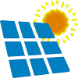
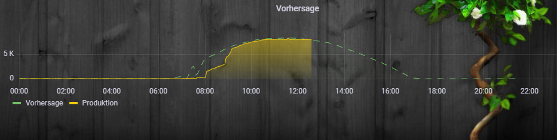

# pvforecast - Adapter zu vorhersage eurer PV Erträge

**Tests:** 

**If you like it, please consider a donation:**

vorhersage eurer PV Erträge
[Deutsche Beschreibung hier](docs/de/pvforecast.md)

## Description
This Adapter replaced the javascript from the iobroker forum https://forum.iobroker.net/topic/26068/forecast-solar-mit-dem-systeminfo-adapter

The adapter take the raw forecast data from [forecast.solar](https://api.forecast.solar) or [Solcast](https://solcast.com/)

## Config

1. longitude (-180 (west) … 180 (east))
2. latiude (-90 (south) … 90 (nord))
4. link to hompage (you can select between solcast and forecast.solar)
5. Api key (not needed for free forecast.solar)
6. graph y-axis step
7. Influxdb (saves the forecastdata to influxdb)
8. states for every hour (generates onjects for every forecast hour for today) 

# forecast.solar
benefit with an api key: 

higher time resolution
datetime -  date and time
sky - A numerical value between 0 and 1 percentage of clear sky [1 = clear sky].
temperature [°C]
condition - text
icon - text + number
wind_speed -  [km/h]
wind_degrees - north at 0°[clockwise]. (windSpeed is zero, value will not be defined)
wind_direction - Short name 

# solcast
the apikey for solcast is for free and you can recieve data with a 30min intervall instead of 1hour at forecast.solar. To use Solcast you need a api key. You dont need a request intervall in config because the solcast data are requested at 1:00 in the night.

# plants config:

1. tilt (0°-90°)
2. Azimuth (-180 = north, -90 = east, 0 = south, 90 = west, 180 = north)
3. plant power (kWh)
4. plat name
5. graph legend name
9. graph color
10. graph label color 

all this information are needed, that the adapter runs perfect.

If longitde and latitude in the iobroker main settings, the adapter will fill out the fields automatic.

## vis exmaple
Please install: [Material Design](https://github.com/Scrounger/ioBroker.vis-materialdesign) before you use the example.

If you want to take the json graph and table you can use this 

## influxDB with Grafarna
with the option influxDB the forecast will be written in your influxDB and with grafarna you can visualize The Forcast with eg. the actual prodiction
 

## test setting
[Here](https://github.com/iobroker-community-adapters/ioBroker.pvforecast/blob/main/docs/example/system.adapter.pvforecast.0.json) you can find a test configuration.

have fun with the adapter

## Changelog
<!--
    Placeholder for the next version (at the beginning of the line):
    ### **WORK IN PROGRESS**
-->
### **WORK IN PROGRESS**
* (MeisterTR) fix error with values before 5 oclock

### 0.2.5 (2022-02-28)
 * (MeisterTR) fix request time
 * (MeisterTR) fix error with weather and solcast
 * (MeisterTR) solcast request only after midnight
### 0.2.4 (2022-02-26)
 * (MeisterTR) added support for Solcast

### 0.2.3 (2022-02-24)
* (MeisterTR) add Unit selection in Config (W/kW)
* (MeisterTR) fixed units in tables
* (MeisterTR) implement Solcast api (next version)
### 0.2.2 (2022-02-22)
* (MeisterTR) fixed timer warning
* (MeisterTR) fixed bootloop in some cases

### 0.2.1 (2022-02-21)

* (MeisterTR) fix typo
* (MeisterTR) fix no every hour folder in summary
* BREAKING CHANGES FROM 0.1.X PLEASE DELETE AND REINSTALL

### 0.2.0
* (MeisterTR) add jsonConfig (No admin4 support)
* (MeisterTR) fixed bugs and errors
* (MeisterTR) total code refactoring

### 0.1.8
* (Patrick Walther) fixed writing to database, log failure

### 0.1.7
* (Patrick Walther)add write to Database function

### 0.1.6
* (Patrick Walther)add timeout, fix bugs and add schedule in settings

### 0.1.5
* (Patrick Walther)repair failure everyhour 

### 0.1.4
* (Patrick Walther)add hourly forecast

### 0.1.2
* (Patrick Walther) remove bugfixes, add weather forecast(api), add new logo from forecast.solar 

### 0.1.0
* (Patrick Walther) add  more plants, add summary, add json graph/table 

### 0.0.3
* (Patrick Walther) added datapoint power_day_tomorrow

### 0.0.2
* (Patrick Walther) added data JSONgraph and JSONtable, fix failure with personal account(url)

### 0.0.1
* (Patrick Walther) initial release

## LICENSE
MIT License

Copyright (c) 2022 Patrick-Walther

Permission is hereby granted, free of charge, to any person obtaining a copy
of this software and associated documentation files (the "Software"), to deal
in the Software without restriction, including without limitation the rights
to use, copy, modify, merge, publish, distribute, sublicense, and/or sell
copies of the Software, and to permit persons to whom the Software is
furnished to do so, subject to the following conditions:

The above copyright notice and this permission notice shall be included in all
copies or substantial portions of the Software.

THE SOFTWARE IS PROVIDED "AS IS", WITHOUT WARRANTY OF ANY KIND, EXPRESS OR
IMPLIED, INCLUDING BUT NOT LIMITED TO THE WARRANTIES OF MERCHANTABILITY,
FITNESS FOR A PARTICULAR PURPOSE AND NONINFRINGEMENT. IN NO EVENT SHALL THE
AUTHORS OR COPYRIGHT HOLDERS BE LIABLE FOR ANY CLAIM, DAMAGES OR OTHER
LIABILITY, WHETHER IN AN ACTION OF CONTRACT, TORT OR OTHERWISE, ARISING FROM,
OUT OF OR IN CONNECTION WITH THE SOFTWARE OR THE USE OR OTHER DEALINGS IN THE
SOFTWARE.
