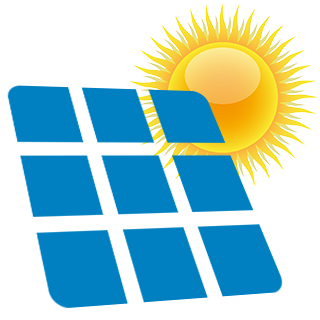

# ioBroker.pvforecast

This Adapter replaced the javascript from the [ioBroker forum](https://forum.iobroker.net/topic/26068/forecast-solar-mit-dem-systeminfo-adapter)

The adapter fetches forecast data from various solar forecast services and provides it as ioBroker states.

## Supported Forecast Services

- **Forecast.solar** - https://forecast.solar
- **Solcast** - https://solcast.com
- **SolarPredictionAPI** - via RapidAPI
- **pvnode** - https://pvnode.com

## Settings

1. longitude (-180 (west) … 180 (east))
2. latitude (-90 (south) … 90 (north))
4. link to homepage
5. Api key
6. graph y-axis step

## With an api-key, you can receive optional the weather data with following points (Forecast.solar only)

higher time resolution
datetime -  date and time
sky - A numerical value between 0 and 1 percentage of clear sky [1 = clear sky].
temperature [°C]
condition - text
icon - text + number
wind_speed -  [km/h]
wind_degrees - north at 0°[clockwise]. (windSpeed is zero, value will not be defined)
wind_direction - Short name

## For the equipment you can make the following settings

1. tilt (0°-90°)
2. azimuth (-180 = north, -90 = east, 0 = south, 90 = west, 180 = north)
3. plant power (kWp)
4. plant name
5. graph legend name
9. graph color
10. graph label color

All this information is needed, that the adapter runs perfect.

If longitude and latitude in the iobroker main settings, the adapter will fill out the fields automatic.

## pvnode

[pvnode](https://pvnode.com) is a German service that provides high-resolution PV forecasts with 15-minute intervals.

### pvnode Configuration

1. **API-Key**: Create an API key at https://pvnode.com/api-keys
2. **Paid account**: Enable this option if you have a paid pvnode account
3. **Forecast days**: Number of forecast days (paid accounts only, max 7). Free accounts automatically get 1 day.
4. **Poll interval**: Recommended: 90 minutes (pvnode updates 16 times per day)
5. **Extra parameters**: Optional API parameters like `diffuse_radiation_model=perez&snow_slide_coefficient=0.5`

### pvnode Account Types

| Feature | Free | Paid |
|---------|------|------|
| API requests/month | 40 | 1,000 |
| Forecast days | 1 (today + tomorrow) | up to 7 |
| Historical data | no | yes (-30 days) |
| Sites | 1 | multiple |

**Important**: Only enable the "Paid account" option if you actually have a paid pvnode account. Otherwise, API errors may occur as the adapter cannot automatically detect your account type.

### pvnode Extra Parameters

The "Extra parameters" field allows passing optional API parameters:

| Parameter | Description | Example |
|-----------|-------------|---------|
| `diffuse_radiation_model` | Radiation model | `perez` |
| `snow_slide_coefficient` | Snow sliding speed factor (0.0-0.8) | `0.5` |
| `shading_config` | Shading configuration | `7:2:3:1_1:1:0:0_0:0:0:0` |

Format: `key1=value1&key2=value2`

### pvnode Notes

- **15-minute resolution**: pvnode provides forecast data in 15-minute intervals
- **Azimuth conversion**: The adapter automatically converts the azimuth value (adapter: 0=south) to the pvnode format (180=south)
- **Request batching**: When multiple plants are configured, the adapter automatically batches up to 2 plants per API request using pvnode's `second_array` feature. This reduces the number of API calls (e.g., 2 plants = 1 request instead of 2). The combined forecast data is stored under the first plant; the second plant is marked as batched.
- **Summary data**: The summary JSON includes clearsky values (summed across all plants). Temperature and weather code are only available per plant, not in the summary.
- The "damping morning" and "damping evening" fields are not used for pvnode

# VIS example

Please install: [Material Design](https://github.com/Scrounger/ioBroker.vis-materialdesign) before you use the example.
If you want to take the json graph and table you can use this [example](./vis.md)
